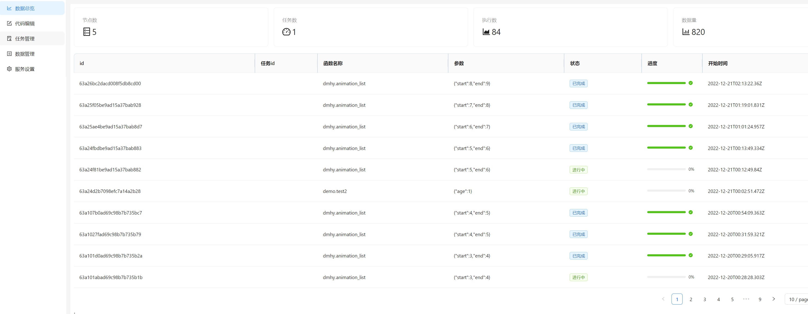
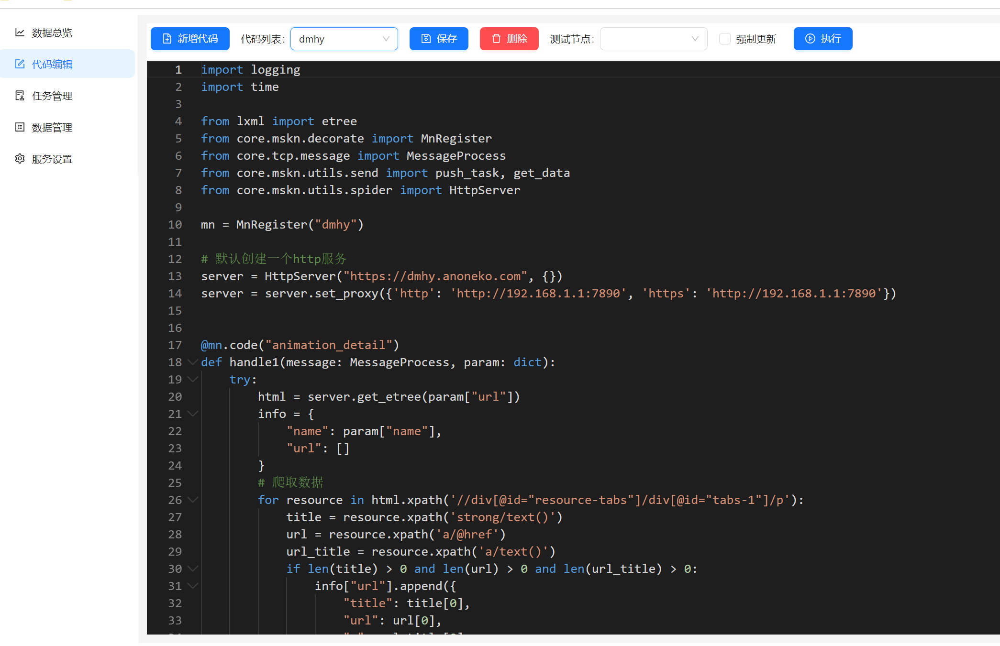
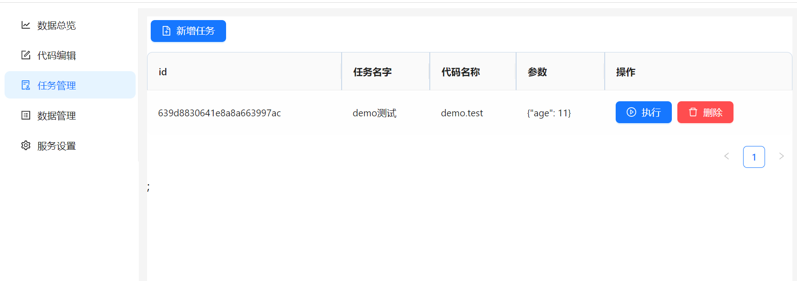
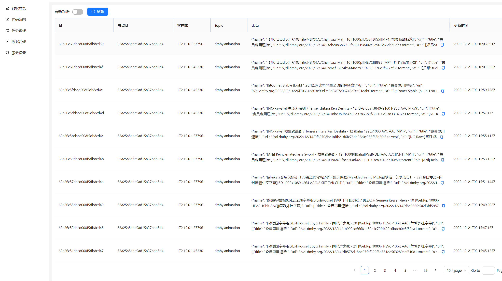
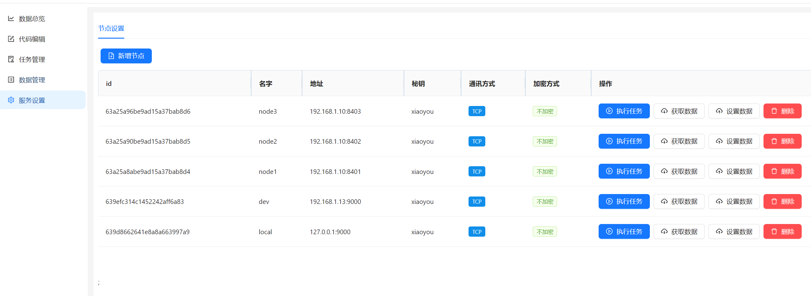

# 御坂网络

> mskn为Misaka Network的缩写

## 项目介绍

一款简单模仿魔禁里御坂网络的项目，你可以部署多个节点构成一个御坂网络，然后每个节点可以相互通讯，当你有任务想让御坂网络执行时，只需要顺便找一个节点接入，然后这个节点可以把任务下发给其他节点，最后所有执行结果会由你连接的节点进行汇总并回传给你。

一个典型的应用就是爬虫了，你可以把御坂节点部署在多个云服务器上，然后你本地可以找一个连接速度最快的节点接入，然后把页面url交给这个节点，这个节点获取所有可爬取的url并把任务下发给其他节点，其他节点爬取到的数据最后都会汇总到你连接的节点，这样就可以避免本地建立多个连接。

## 项目结构

- mskn-node 御坂网络节点，你可以部署很多个

- mskn-server 类似于一方通行的项圈，它可以和御坂网络节点交互，把任务下发给御坂网络，然后把汇总的数据存储到MongoDB中

- mskn-web 网页客户端，可以在这个客户端上面进行代码编辑，任务下发操作

## 任务代码介绍

这里简单介绍一下动漫花园的爬虫代码，具体看注释

```py
import logging
import time

from lxml import etree
from core.mskn.decorate import MnRegister
from core.tcp.message import MessageProcess
from core.mskn.utils.send import push_task, get_data
from core.mskn.utils.spider import HttpServer
# 这个是注册一个任务，需要写上任务的名字
mn = MnRegister("dmhy")

# 默认创建一个http服务，这里就是简单封装了一下request请求
server = HttpServer("https://dmhy.anoneko.com", {})
server = server.set_proxy({'http': 'http://192.168.1.1:7890', 'https': 'http://192.168.1.1:7890'})

# 这里注册具体的代码，animation_detail就是代码的名字
# 如果要执行就需要任务名称+函数名字，比如这个就是 dmhy.animation_detail 
@mn.code("animation_detail")
# 每个函数都会包含这两个参数，一个是用于消息上报，另一个是执行任务下发的参数
def handle1(message: MessageProcess, param: dict):
    try:
        html = server.get_etree(param["url"])
        info = {
            "name": param["name"],
            "url": []
        }
        # 爬取数据
        for resource in html.xpath('//div[@id="resource-tabs"]/div[@id="tabs-1"]/p'):
            title = resource.xpath('strong/text()')
            url = resource.xpath('a/@href')
            url_title = resource.xpath('a/text()')
            if len(title) > 0 and len(url) > 0 and len(url_title) > 0:
                info["url"].append({
                    "title": title[0],
                    "url": url[0],
                    "a": url_title[0]
                })
        # 推送数据
        logging.info("get {} success url size {}".format(info["name"], len(info["url"])))
        # 这里就是推送数据了，前面是数据topic，后面就是具体的数据内容
        # 这里推送的数据会传给客户端
        message.data_push("dmhy.animation", info)
    except Exception as e:
        logging.info("get url {} err, err info {}".format(param["url"], e))
        message.data_push("dmhy.animation.err", param)


@mn.code("animation_list")
def handle2(message: MessageProcess, param: dict):
    # 创建一个http服务
    for index in range(param["start"], param["end"]):
        logging.info("current page is {}".format(index))
        html = server.get_etree("/topics/list/page/{}".format(index))
        # 遍历所有的表格
        for topic in html.xpath('//table[@id="topic_list"]/tbody/tr'):
            title = topic.xpath('td[@class="title"]/a/text()')
            url = topic.xpath('td[@class="title"]/a/@href')
            if len(title) > 0:
                logging.info("start get {}".format(title[0].replace("\n", "")))
                # 这里是任务下发，可以让子节点去执行任务
                # ["node2","node3"]是执行的节点，这里会随机选取一个节点
                # dmhy.animation_detail 是子节点执行的任务，后面就是具体参数
                push_task(message, ["node2","node3"], "dmhy.animation_detail", {
                    "name": title[0].replace("\n", ""),
                    "url": url[0]
                })
                # 为了避免冲突，2s后才请求一次
                time.sleep(2)
```

## 项目截图










